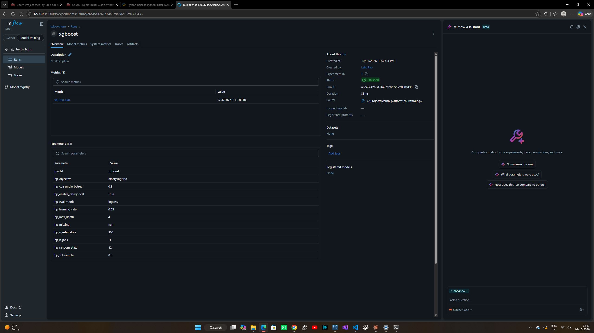

# Telecom Customer Intelligence Platform

End-to-end data science project: **MySQL -> ETL -> feature engineering -> model comparison (MLflow) -> segmentation -> batch scoring -> FastAPI -> Streamlit dashboard -> Docker -> CI**.

**Business problem:** Telecom company ko pata hona chahiye kaun sa customer churn karega, kitna revenue risk me hai, aur customers ke kaun se segments hain, taaki retention team sahi logon ko target kare.

## Architecture
```
CSV / Kaggle  --ingest-->  MySQL (customers)
                              |
             features.py -> train.py (LogReg / RF / XGBoost, MLflow) -> models/churn_model.joblib
                              |                                            |
                 segment.py (KMeans) -> customer_segments        predict.py -> churn_scores
                              |                                            |
                              +------------- Streamlit dashboard ----------+
                                         FastAPI  (/predict, logs to prediction_log)
```

## Tech stack
Python, Pandas, NumPy, SQLAlchemy, **MySQL**, scikit-learn, XGBoost, KMeans, MLflow, FastAPI, Pydantic, Streamlit, Plotly, pytest, Docker, GitHub Actions.

## Setup (Windows)
1. Install: Python 3.11+, MySQL Server 8 (mysql.com/downloads/installer), VS Code, Git.
2. MySQL install karte waqt root password yaad rakho.
3. Project folder me terminal kholo:
```bash
python -m venv venv
venv\Scripts\activate
pip install -r requirements.txt
copy .env.example .env        # phir .env me MYSQL_PASSWORD apna daalo
```
4. (Optional) MySQL me check karo: `mysql -u root -p` -> `SHOW DATABASES;` (database `churn_db` code khud bana dega, ya `sql/schema.sql` run karo).
5. Dataset: Kaggle se "Telco Customer Churn" download karo, `data/raw/telco_churn.csv` naam se rakho. Na ho to code synthetic data (same schema) khud bana leta hai.

## Run (order me)
```bash
python -m churn.ingest      # CSV -> MySQL
python -m churn.train       # models compare, best save, reports/ banti hai
python -m churn.segment     # KMeans segments -> MySQL
python -m churn.predict     # sab customers ka churn score -> MySQL
mlflow ui --backend-store-uri sqlite:///mlflow.db     # http://127.0.0.1:5000
uvicorn churn.api:app --reload                        # http://127.0.0.1:8000/docs
streamlit run dashboard/app.py                        # http://localhost:8501
pytest                                                # tests
```
Test API:
```bash
curl -X POST http://127.0.0.1:8000/predict -H "Content-Type: application/json" -d "{\"tenure\":3,\"monthly_charges\":95.5,\"total_charges\":286.5,\"contract\":\"Month-to-month\",\"internet_service\":\"Fiber optic\",\"payment_method\":\"Electronic check\"}"
```

## Docker (MySQL + API + Dashboard)
```bash
python -m churn.train           # pehle model bana lo (models/ folder image me copy hota hai)
docker compose up --build -d
docker compose run --rm api python -m churn.ingest
docker compose run --rm api python -m churn.predict
docker compose run --rm api python -m churn.segment
```
"Docker's MySQL is published on host port 3307 to avoid clashing with a local MySQL on 3306."
API: localhost:8000/docs | Dashboard: localhost:8501

## Results (apne run ke numbers yahan paste karo)
   | Model | Val ROC-AUC |
   |---|---|
   | Logistic Regression | 0.8351 |
   | Random Forest | 0.8355 |
   | XGBoost | 0.8378 |

   Test: ROC-AUC 0.8321 | Precision 0.517 | Recall 0.746 (threshold tuned on validation set).

## Key design decisions (interview ke liye)
- **Train / validation / test split** (70/15/15): model aur threshold validation pe chune, test sirf final report ke liye, isse leakage nahi.
- **Pipeline + ColumnTransformer**: preprocessing model ke saath save hoti hai, serving me skew nahi.
- **Ek hi `add_features()`** training, batch scoring aur API me.
- **Threshold tuning**: 0.5 default nahi, F1 maximise kiya (business cost ke hisaab se recall badha sakte ho).
- **MySQL** source of truth; API predictions `prediction_log` me store hoti hain (monitoring).
- **Tests + CI**: API contract, validation errors, sanity (risky customer > loyal customer).

## Deploy
- Dashboard: Streamlit Community Cloud (public cloud MySQL chahiye: Aiven free MySQL ya TiDB Cloud free tier; credentials `st.secrets` / env me).
- API: Render (Docker) + same cloud MySQL. Free tier sleep hota hai.
- Free tier limits badalti rehti hain, deploy se pehle current docs dekh lena.

## python -m churn.train
Training worked. Your churn rate is 26.5%, which matches the standard Kaggle dataset, and all three models scored about the same:

Model	Validation ROC-AUC
Logistic Regression	0.8351
Random Forest	0.8355
XGBoost (best)	0.8378

## Best line
num__is_month_to_month	0.44710192

## Segment
 |  k=2 silhouette=0.480
 | k=3 silhouette=0.450
 | k=4 silhouette=0.470
 | k=5 silhouette=0.447
 | k=6 silhouette=0.439
 | Chosen k = 2
            customers  avg_tenure  avg_monthly  churn_rate                 segment_label
segment_id
0                2361       56.85        89.76        0.17  Long-tenure / High-bill (#0)
1                4682       20.03        52.16        0.31  Short-tenure / Low-bill (#1)
## Predict
predict | Scored 7043 customers -> table churn_scores (676 high risk)

## Key Points From Segment, Predict
Segments: silhouette picked k=2, which gives two clear groups. The long-tenure, high-bill group (2,361 customers, about 57 months, $89.76 average bill) churns at 17%. The short-tenure, low-bill group (4,682 customers, about 20 months, $52.16 average bill) churns at 31%. That is a clean business story: newer, lower-spending customers leave most.
A caveat to mention in interviews: k=2 won by a small margin (0.480, versus 0.470 for k=4). Two segments is a coarse split. If you want more actionable groups for the retention team, k=4 is a defensible alternative.
Scoring: 676 of 7,043 customers (about 9.6%) are in the High risk band (churn probability of 0.70 or more).
## SQL QUERY ANLAYSIS
risk_band, customers, avg_prob
High	676	    0.794
Medium	1324	0.549
Low	    5043	0.119

## Risky customer test (same Swagger page)
curl -X 'POST' \
  'http://127.0.0.1:8000/predict' \
  -H 'accept: */*' \
  -H 'Content-Type: application/json' \
  -d '  {
  "customer_id": "TEST-RISKY",
  "tenure": 3,
  "monthly_charges": 95.5,
  "total_charges": 286.5,
  "contract": "Month-to-month",
  "internet_service": "Fiber optic",
  "payment_method": "Electronic check"
}'

## Check that predictions were logged
id,     created_at,         customer_id,    churn_probability,  risk_band,  model_version
2	    2026-10-01 16:20:33	TEST-RISKY	    0.8654	            High	    xgboost-202610011245
1	    2026-10-01 13:22:38	string	        0.2799	            Low	        xgboost-202610011245

## Things worth knowing for your README and interviews:

Duplicate top features: in the "Top 10 features" chart, num__is_month_to_month and cat__contract_Month-to-month carry the same information, so they split the importance between them. Both come from the contract column. A good interview answer is: "Month-to-month contract is the dominant churn driver; the two features are redundant encodings, and I'd drop one in a cleanup."
Tenure chart order: the tenure bars appear as 0-11, 12-23, 48+, 24-47, because plotly orders them by first appearance. To fix it, in dashboard/app.py change the tenure chart call to:
  st.plotly_chart(px.bar(by_tenure, x="tenure_band", y="churn_pct",
                         title="Churn % by tenure (months)",
                         category_orders={"tenure_band": ["0-11", "12-23", "24-47", "48+"]}),
                  width="stretch")

## screenshots streamlit app


## screenshots MLFLOW BROWSER





## http://127.0.0.1:8000/health


## MYSQL screenshots


## Run sql/analysis_queries.sql and write one insight each

1. **Churn by contract:** Month-to-month customers churn at 42.7% (3,875 customers), versus 11.3% on one-year and 2.8% on two-year contracts, so contract length is the strongest churn signal.

2. **Revenue at risk:** Customers who churned represent 139,130.85 in lost monthly recurring revenue (about 1.67M annualised).

3. **Retention call list:** The 20 highest-value high-risk customers are all month-to-month, pay 104.65 to 110.10 per month, and have churn probabilities of 0.71 to 0.91.

4. **Bill ranking (window function):** RANK() OVER (PARTITION BY contract) ranks all 7,043 customers within their contract type; the highest month-to-month bill is 117.45 (customer 2302-ANTDP), and equal bills share a rank.

5. **API monitoring:** prediction_log recorded 2 predictions on 2026-10-01 with an average churn probability of 0.573 (my manual test calls through Swagger).

## Docker Setup runned and tested successfully
python -m churn.train
docker compose up --build -d
docker compose run --rm api python -m churn.ingest
docker compose run --rm api python -m churn.predict
docker compose run --rm api python -m churn.segment


